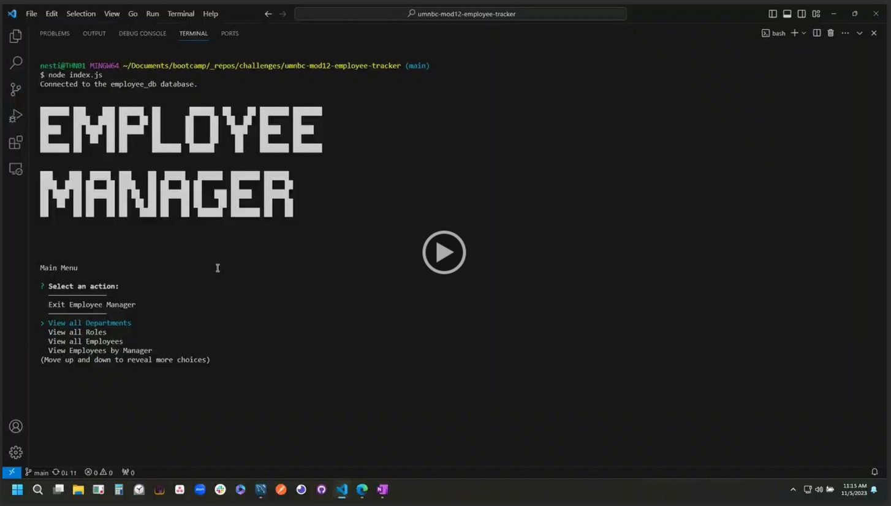

# SQL: Employee Tracker
*University of Minnesota - Coding Boot Camp - Module 12 SQL Challenge*


## Description

A command-line Content Management System (CMS) to manage a company's employee database, using Node.js, Inquirer, and MySQL.

## Table of Contents
- [Usage](#usage)
- [Installation](#installation)
- [Credits](#credits)
- [License](#license)

## Usage

#### Demo Video

[](https://drive.google.com/file/d/1l8VGn7Q8Y3X4o7D860xcbB1J2X6VCfRI/view)

## Installation 

#### 1. Install [Node.js](https://nodejs.org/) and [MySQL](https://www.mysql.com/) locally

#### 2. Clone or Fork the Repo

#### 3. Open Repo Directory in VS Code Integrated Terminal (or Git Bash)

#### 4. Invoke the following command from a MySQL command-line to seed the database
```
source ./db/schema_and_seeds.sql
```

#### 5. Invoke the following command from a Bash command-line to install dependencies
```bash
npm install
```

#### 6. Invoke the following command from a Bash command-line to launch the application
```bash
node index.js
```


## Credits
- © 2023 edX Boot Camps LLC.
- [ASCII Art Generator - patorjk.com](https://patorjk.com/software/taag/#p=display&f=ANSI%20Regular&t=Employee%0AManager)

## License

- The content of this application is licensed under the [MIT License](https://choosealicense.com/licenses/mit/){:target="_blank"}

